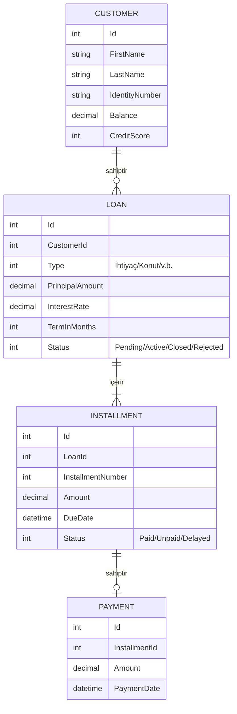
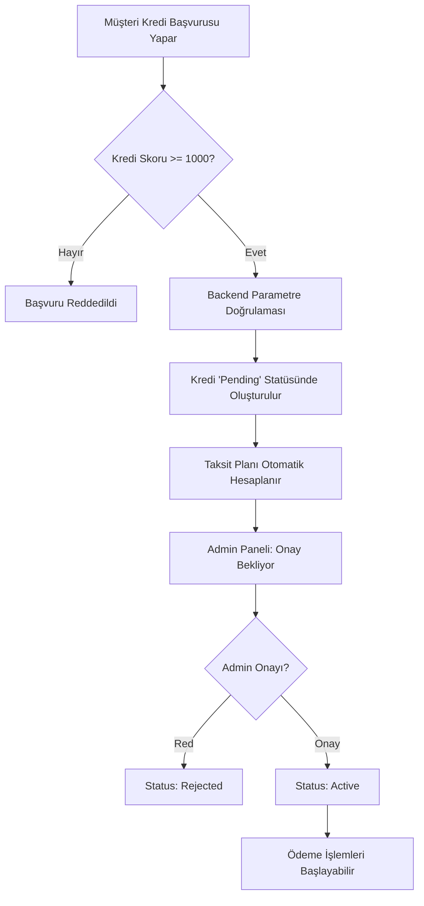

# Dijital Kredi ve Geri Ödeme Yönetim Sistemi

Bu proje, bir bankanın bireysel müşterilerine sunduğu dijital kredi ürünlerinin (İhtiyaç, Eğitim, Taşıt) tüm yaşam döngüsünü yöneten full-stack bir bankacılık uygulamasıdır. **Clean Architecture** prensipleriyle geliştirilmiş, veri tutarlılığı ve bankacılık domain mantığına odaklanmıştır.

## 🚀 Teknolojiler ve Mimari

- **Backend:** .NET 8, C#, EF Core (Clean Architecture)
- **Frontend:** React 18, Vite, Vanilla CSS
- **Veritabanı:** MySQL (PostgreSQL/SQL Server uyumlu)
- **Mimari:**
  - **Core:** Entity'ler, Domain Enum'ları ve Repository arayüzleri.
  - **Application:** Business Logic, Service katmanı ve DTO/Entity mapping.
  - **Infrastructure:** Veritabanı context'i, Repository implementasyonları ve Mock servisler.
  - **API:** RESTful Endpoint'ler ve Exception Handling.

## 🤖 Yapay Zeka (AI) Kullanım Bildirimi

Bu proje geliştirilirken **Antigravity (Google Deepmind)** yapay zeka asistanı aktif bir "Pair Programmer" olarak kullanılmıştır.

- **Kod Üretimi:** Boilerplate kodların (Entity, DTO, Repository) hızlı üretimi.
- **Refactoring:** Kod okunabilirliğini artırmak ve Clean Architecture standartlarına uyum sağlamak için kullanıldı.
- **Validation:** Kategori bazlı kredi parametrelerinin backend doğrulaması AI desteğiyle kurgulandı.
- **Test Senaryoları:** Yetersiz bakiye ve düşük kredi skoru gibi uç durumların simülasyonu için SQL ve logic önerileri alındı.
- **Kontrol:** AI tarafından üretilen tüm mantıksal çıktılar (özellikle kredi hesaplama algoritması) manuel olarak gözden geçirilmiş ve bankacılık standartlarına göre revize edilmiştir.

## 📊 Veri Modeli ve İlişkiler (ER Diagram)

## 🔄 İş Akışı (Kredi Oluşturma -> Taksit Üretme)

## 🔌 API Endpoints

### Customers
- `GET /api/customers` - Tüm müşterileri listeler
- `GET /api/customers/{id}` - Müşteri detayı (Borç özeti ile)
- `POST /api/customers` - Yeni müşteri oluşturma
- `PUT /api/customers/{id}` - Müşteri güncelleme
- `DELETE /api/customers/{id}` - Müşteri silme

### Loans
- `GET /api/loans` - Kredileri listeler (Query: customerId)
- `GET /api/loans/{id}` - Kredi ve taksit planı detayları
- `POST /api/loans` - Kredi başvurusu (Otomatik taksit üretimi ile)
- `PUT /api/loans/{id}` - Kredi durumu güncelleme (Onay/Red/Kapatma)

### Payments
- `POST /api/payments` - Taksit ödemesi (Bakiye kontrolü ve düşümü ile)
- `GET /api/payments/{id}` - Ödeme makbuzu detayı

## 🛠️ Kurulum ve Çalıştırma

1. **DB:** MySQL'de `DigitalLoanDb` oluşturun.
2. **Migrations:** `dotnet ef database update` komutunu Infrastructure projesinde çalıştırın.
3. **Mock Data:** `mock_data.sql` dosyasını veritabanında çalıştırın.
4. **Run:** Backend (`dotnet run`) ve Frontend (`npm run dev`) projelerini başlatın.

---
*Bu proje, aday değerlendirme süreci (Case Study) kapsamında bankacılık domain mantığı ve tutarlılığı ön planda tutularak geliştirilmiştir.*
